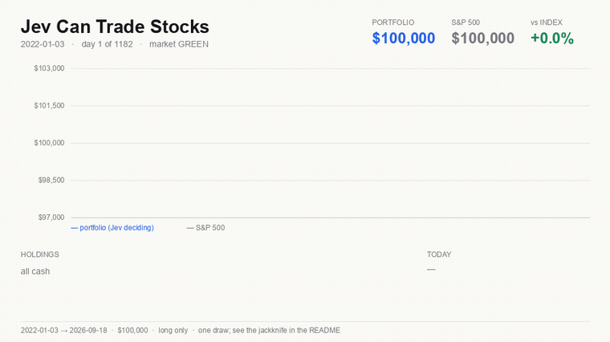

# Jev Can Trade Stocks

A point-in-time backtest of a **William O'Neil momentum strategy**, 2022-01-03
to 2026-09-18, $100,000, long only, benchmarked against the S&P 500.

**[Jev](https://typesafe.ai) — TypeSafe's System One model — picks the entries
and decides the exits.** Deterministic code owns the data, the signals, the
stops and the fills, and never delegates risk.



*Four and a half years in twelve seconds. Rendered from `web/data.js` by
`src/make_gif.py`, so the frames cannot drift from the numbers the arms report.
Run the page yourself with `python3 -m http.server 8000 --directory web`.*

> **The write-up:** [关于 Jev，大家普遍用错的一件事](POST.md) — what this project
> got wrong about using a System One model, and the eight rules that came out of
> it. Starts from a question with nothing to do with stocks: *what day is it
> today?* The experiment behind it is
> [`examples/what_day_is_it.py`](examples/what_day_is_it.py) — runs in five
> minutes for well under a cent.


## Result

| | Final | Profit | Max drawdown |
|---|---|---|---|
| **Jev entry + exit** | **$207,746** | **+$107,746** | **−15.9%** |
| Rules only, no Jev | $170,234 | +$70,234 | −20.8% |
| Rules + mechanical earnings gate | $159,395 | +$59,395 | −23.1% |
| S&P 500 buy & hold | $159,500 | +$59,500 | −25.4% |

**Do not cite that first row as an edge.** It is one draw from a wide
distribution, and this repository measures the distribution rather than
reporting the draw.

### What the measurement actually says

The portfolio holds 5 positions and makes ~22 buys a year, so which stocks it
happens to catch dominates the outcome. To size that, `src/jackknife.py`
deletes 49 tickers from the universe — the same number that are genuinely
missing from the price data — rebuilds every signal, and re-runs **both** arms
on the identical deleted panel, differencing them within each draw.

```
undeleted panel      Jev − rules = +$37,512
across 12 draws      mean +$4,048   sd $25,029   Jev ahead in 7 of 12
```

Seven of twelve is what a coin does. **Jev does not beat the mechanical rules
by any margin this experiment can resolve.**

What the work *did* achieve is only visible against the same measurement taken
before it:

| | mean paired difference | Jev ahead in |
|---|---|---|
| before the prompt and contract fixes | **−$23,315** | 1 of 12 |
| after | **+$4,048** | 7 of 12 |

Jev used to be *reliably worse* than the rules. It is now indistinguishable
from them. That is a real, measured improvement, and it is not an edge.

One risk characteristic: the paired standard deviation ($25,029) exceeds
either arm's own ($17,952). Jev's decisions **add** variance rather than
cancelling it, so outcomes spread wider with the model in the loop — even
though the drawdown on this particular panel was smaller.

Jev makes ~790 decisions per run. A full run costs about **$0.12**; rebuilding
the 22,398-row assessment artifact costs about **$1.35**.

## How Jev is used

Jev is a **decision model**, not a text generator: it returns typed values with
calibrated probabilities in 70–500 ms. It cannot be fine-tuned and does not
learn between calls — every call is stateless, and its specialization comes
entirely from the rules supplied in the request.

**Entry.** Five narrow judgments over the same anonymised evidence — 16 weekly
bars, 20 daily bars into the breakout, and the company's SEC earnings as filed:

| Question | Primitive | Role |
|---|---|---|
| `setup` | `Choice` | Valid / developing / faulty / insufficient base |
| `pattern` | `Choice` | Flat base, cup, cup with handle, double bottom, none |
| `earnings` | `Noul` | Does profit growth meet O'Neil's 25% test? |
| `supply` | `Noul` | Volume contracting through the base, expanding on the break? |
| `prior_advance` | `Noul` | Resting from a rise, or forming in a decline? |

**Exit.** Jev reviews each holding on a cadence and decides hold or sell on its
own evidence. There is no mechanical rule for it to veto.

Weights, gates and the buy zone are **policy and live in code**
(`jev.entry_policy`, `strategy.BUY_ZONE_MAX_PCT`), not in the model. The 7%
stop and the 15% trailing stop are standing orders that fire regardless of what
Jev thinks: a calibrated probability is not a risk limit.

Every `state` is anonymised: **no ticker, no date, no absolute price.** A model
with a 2026 cutoff knows what happened in this window; showing it a symbol would
defeat every other point-in-time safeguard in the project.

### The thing that mattered most: Jev knows only what it is told

Run this yourself: [`examples/what_day_is_it.py`](examples/what_day_is_it.py),
five minutes, well under a cent. The longer write-up is [POST.md](POST.md).

Ask Jev what day it is with nothing in the state and it answers "Monday" at
**0.12 confidence** — below the 0.14 you get from guessing. Give it a
`cannot_tell` option and it answers that, at **1.00**. Put "today is Thursday"
in the state and it answers Thursday, at 1.00. It has no clock. It knows what
you hand it.

Two distinct failures follow from that, and this project had both.

**Assert a conclusion in the state and Jev ratifies it.** The exit prompt used
to open *"a mechanical rule has already decided to SELL this position — should
it be overridden?"* Measured across cached answers on the same positions, with
only the wording differing:

| framing | keeps the position | mean confidence |
|---|---|---|
| neutral — "which is this doing?" | 46.0% | 0.38 |
| override — "should the sell be overridden?" | **2.4%** | **0.90** |

Jev was not judging the chart. It was agreeing with a sentence, confidently —
exactly as it answers 0.96 that today is Monday while answering 0.11 that it
could verify that.

**Withhold evidence and the distribution goes flat.** `strategy.py` declared
the C and A of CAN SLIM out of reach because "yfinance cannot supply
point-in-time fundamentals for delisted names." True of yfinance, false of
EDGAR: every XBRL fact carries the date it was *filed*, so the facts visible on
day *t* are exactly those with `filed <= t`. On the 353 breakouts this strategy
took, O'Neil's 25% quarterly earnings test separates 60-day forward returns by
**4.8 points (permutation p = 0.0095)**. Given those figures, Jev's judgment
agrees with the arithmetic on **95%** of a 289-row sample.

Both fixes were validated on a **$0.05 sample with the predictions committed to
git beforehand** (`src/prove_fix.py`), so a disappointing result could not be
reinterpreted afterwards as a success:

| | before | after |
|---|---|---|
| `pattern` confidence (uniform 0.200) | 0.257 | **0.297** |
| undecided Nouls (within ±0.15 of 0.50) | 45.4% | **37.0%** |
| exit keep rate, weakened positions | 2.4% | **28.6%** |
| exit confidence, weakened (uniform 0.333) | 0.380 | **0.676** |

### Does Jev actually understand O'Neil?

Tested separately from profitability, because a correct pattern reading can
still lose money. [`src/exam_oneil.py`](src/exam_oneil.py) generates 48 paired
cases whose invariants hold **by construction**: noise is drawn once per seed
and shared between the arms, so a volume pair really is one price path with two
volume profiles, and the pivot is derived from the generated highs rather than
asserted.

| Test | Result |
|---|---|
| `supply` on the volume pairs | 0.90 vs 0.15 — **12/12** |
| `prior_advance` on the advance pairs | 0.88 vs 0.51 — **12/12** |
| Selection: sound in-zone base vs extended one | **12/12** |
| `pattern` confidence on clean fixtures | 0.43 (uniform 0.20) |

An earlier version of this exam tested questions the shipped strategy never
called, on fixtures whose "good" cases did not clear their own stated breakout
level. See [`codex-rereview.md`](codex-rereview.md).

## Honesty machinery

This repo is mostly an apparatus for not fooling yourself.

- **Timing contract.** Signals on day `t` use bars through day `t`'s close.
  Entries and trend-break exits fill at day `t+1`'s open. Stops fill intraday.
  `src/test_timing.py` proves a later close cannot change an earlier fill, and
  is itself proven to fail against the original defect.
- **Point-in-time universe.** Index membership is read from the Wikipedia
  revision live on each date. RS is ranked only against that day's members.
  **49 of 635 members (7.7%) have no price data** because yfinance does not
  serve delisted tickers — see [`SURVIVORSHIP.md`](SURVIVORSHIP.md). The gap
  cannot be closed with the available providers, so it is measured instead.
- **Frozen contracts.** `prereg_*.md`, `rubric.md`, `deferral_contract.md` and
  `policy_contract.md` are written before the runs they govern.
- **Carried contract.** `anchor.py` freezes what was concluded about a setup at
  the decision and carries it forward. The base a position broke out of used to
  be recomputed from a rolling 65-session high, which climbs with the stock: ten
  sessions after one real breakout the prompt said −3.3% when the truth was
  +0.1%. The sign was wrong, not just the magnitude.
- **One policy resolution.** `policy.py` turns the switches into the policy that
  executes, once. `JEV_EXIT_MODE=2` used to fire without consulting `JEV_EXIT`,
  and the result's config recorded neither.
- **Artifact provenance.** Assessment files carry a manifest — question
  fingerprint, model, coverage, per-row status — and the loader refuses one
  written by different criteria, or below `COVERAGE_MIN`. A run that exhausted
  its API credits half way wrote 51% coverage and would otherwise have loaded as
  a complete universe.
- **Bounded delegation.** Jev may defer a mechanical exit at most 10 sessions,
  and may abstain at most `ABSTAIN_MAX` times in a row before the rule takes the
  decision back. Confident holds are **not** bounded: holding a leader for
  months is the strategy working. The 7% stop and 15% trailing stop fire
  regardless.
- **Failure is not a decision.** An inference error hands the call back to the
  mechanical rule and is charged to the run, never credited to Jev. A run whose
  error rate exceeds `ERROR_RATE_MAX` prints *"this run is not a result."*
- **Reproducible.** `run_jev.py --replay` serves only from cache and reproduces
  every figure with zero network calls.
- **Pre-repair outputs** are kept in `data/pre_repair/` and must not be cited.

## What has been ruled out

Each cost real work; see [`help-me-design.md`](help-me-design.md).

- O'Neil's fixed 20–25% profit target is the single most damaging rule.
- Macro overlays and industry-group RS filters both reduce returns.
- Walk-forward parameter re-fitting loses to a fixed setting (1 of 7 folds).
- Jev's chart-shape judgment does not predict forward returns (three
  pre-registered framings, all null — `help-me-design.md` §5).
- Jev reads SEC filings well (F1 0.931 on guidance withdrawal) but trading on
  it has no decision value — the ceiling test fails too (`GUIDANCE_EVAL.md`).
- A mechanical earnings gate **hurts**, costing $10,839, even though the same
  criterion separates forward returns at p = 0.0095. The book holds 5 positions
  and makes ~22 buys a year, so a real per-signal edge cannot be expressed.
  More slots or more candidates, not more prompt work, is the open lever.

## Run it

```bash
python3 -m venv .venv
.venv/bin/python -m pip install pandas numpy yfinance pyarrow requests lxml typesafe-sdk
echo "TYPESAFE_API_KEY=..." > .env          # gitignored

.venv/bin/python src/universe.py            # PIT index membership
.venv/bin/python src/sectors.py             # PIT GICS
cd src
../.venv/bin/python data.py                 # ~586 tickers of daily bars; shouts
                                            #   if the survivorship gap > 2%
../.venv/bin/python fundamentals.py         # PIT SEC earnings, by filing date
../.venv/bin/python test_timing.py          # 6 timing / integration guards
../.venv/bin/python test_contracts.py       # 27 anchor / policy / exit guards
../.venv/bin/python prove_fix.py            # ~$0.05 pre-registered sample proof
../.venv/bin/python jev_select.py           # ~$1.35 full assessment artifact
../.venv/bin/python run_exam.py             # conformance exam
../.venv/bin/python compare.py              # the five arms
../.venv/bin/python jackknife.py 12         # the verdict
```

**Spend discipline.** Changing any prompt changes its fingerprint and forces a
full 22,398-row re-ask. Batch every prompt change, validate on
`jev_select.py --sample 300` (about 3¢), and spend a full pass only when the
wording is frozen. Re-running an *unchanged* prompt is free — it is served from
cache.

Strategy parameters are at the top of `src/strategy.py`.

## Layout

```
src/universe.py     point-in-time index membership from Wikipedia revisions
src/sectors.py      point-in-time GICS classification
src/data.py         daily OHLCV panel via yfinance
src/strategy.py     O'Neil rules as vectorised indicators; all params at top
src/groups.py       industry-group relative strength
src/macro.py        macro regime from traded proxies
src/edgar.py        SEC filing corpus with acceptance timestamps
src/jev.py          the Jev boundary — anonymised state, cached, policy in code
src/anchor.py       the carried contract — what was concluded, frozen
src/policy.py       one resolution of the switches into the executed policy
src/fundamentals.py point-in-time SEC XBRL earnings, keyed on filing date
src/exam_oneil.py   strategy-comprehension exam, 48 paired cases
src/run_exam.py     runs the exam against the questions that actually ship
src/prove_fix.py    pre-registered sample proof of the state/framing fixes
src/make_gif.py     renders the README replay from web/data.js
examples/           standalone, runnable demonstrations
POST.md             the write-up: how to use Jev correctly
src/compare.py      the fixed five-arm comparison
src/jackknife.py    paired deletion experiment — the verdict
src/backtest.py     day-by-day simulation
src/walkforward.py  18m train / 6m test / 6m step
src/experiments.py  ablation runner
src/run_jev.py      supported entry point; writes the decision ledger
src/run_all.py      driver; writes web/data.js
src/test_timing.py  timing and integration guards
src/test_contracts.py  anchor, policy and autonomous-exit guards
web/index.html      animated replay page
docs/architecture/  diagram trio — index.html, PNG, prompt.md
```

## Licence

MIT. Not investment advice; a backtest is not a live trading record.
