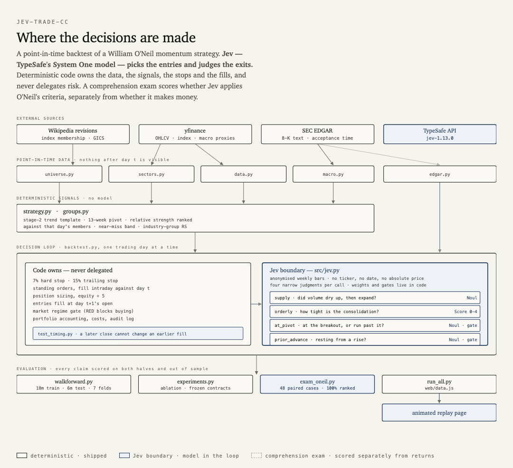

# Jev Can Trade Stocks

A point-in-time backtest of a **William O'Neil momentum strategy**, 2022-01-03
to 2026-09-18, $100,000, long only, benchmarked against the S&P 500.

**[Jev](https://typesafe.ai) — TypeSafe's System One model — picks the entries
and judges the exits.** Deterministic code owns the data, the signals, the stops
and the fills, and never delegates risk. It finished at **$171,060** against the
index's $159,500, at a shallower drawdown.



## Result

| | Final | Profit | CAGR | Max drawdown | Return ÷ vol |
|---|---|---|---|---|---|
| **Jev deciding** | **$171,060** | **+$71,060** | **+12.1%** | **−19.7%** | **0.72** |
| Rules only, O'Neil's 20–25% target | $106,500 | +$6,500 | +1.3% | −20.2% | 0.09 |
| S&P 500 buy & hold | $159,500 | +$59,500 | +10.4% | −25.4% | 0.61 |

113 closed trades, 32.7% win rate, profit factor 1.5. Jev makes ~124 decisions
per run at a total cost under **$0.06**.

Read [`NEARMISS_RESULT.md`](NEARMISS_RESULT.md) before citing the margin over
the index: it leans heavily on one position (MRVL, +125.9%).

## How Jev is used

Jev is a **decision model**, not a text generator: it returns typed values with
calibrated probabilities in 70–500 ms. It cannot be fine-tuned and does not
learn between calls — every call is stateless, and its specialization comes
entirely from the rules supplied in the request.

Four narrow judgments, asked in one call over the same anonymised weekly bars:

| Question | Primitive | Role |
|---|---|---|
| `supply` | `Noul` | Did volume contract through the base, then expand on the break? |
| `orderly` | `Score` 0–4 | How tight are the weekly ranges? |
| `at_pivot` | `Noul` | At the breakout level, or already run past it? **Hard gate.** |
| `prior_advance` | `Noul` | Resting from a rise, or forming in a decline? **Hard gate.** |

Weights and gates are **policy and live in code** (`jev.entry_policy`), not in
the model — so a weight can change without re-running inference, and any trade
can be traced to the judgments behind it.

Every `state` is anonymised: **no ticker, no date, no absolute price.** A model
with a 2026 cutoff knows what happened in this window; showing it a symbol would
defeat every other point-in-time safeguard in the project.

### Does Jev actually understand O'Neil?

Tested separately from profitability, because a correct pattern reading can
still lose money. [`src/exam_oneil.py`](src/exam_oneil.py) generates 48 paired
cases that differ in exactly one dimension, so the label follows from how the
bars were built rather than from anyone's judgment.

| Dimension | Judgment | Good | Bad | Pairs ranked correctly |
|---|---|---|---|---|
| Volume dry-up | `supply` | 0.89 | 0.16 | 100% |
| Extension past the pivot | `at_pivot` | 0.70 | 0.40 | 100% |
| Tightness of the base | `orderly` | 2.70 | 1.67 | 100% |
| Prior advance | `prior_advance` | 0.93 | 0.30 | 100% |

An earlier version failed two of these: it bought bases forming at the bottom of
a decline 100% of the time, and barely registered buying 18% above the pivot.
Both were defects in the prompt, not the model — the criteria never mentioned
either rule. See [`codex-oneil-prompt-review.md`](codex-oneil-prompt-review.md).

## Honesty machinery

This repo is mostly an apparatus for not fooling yourself.

- **Timing contract.** Signals on day `t` use bars through day `t`'s close.
  Entries and trend-break exits fill at day `t+1`'s open. Stops fill intraday.
  `src/test_timing.py` proves a later close cannot change an earlier fill, and
  is itself proven to fail against the original defect.
- **Point-in-time universe.** Index membership is read from the Wikipedia
  revision live on each date, so delisted names are still present. RS is ranked
  only against that day's members.
- **Frozen contracts.** `prereg_*.md`, `rubric.md`, `deferral_contract.md` and
  `policy_contract.md` are written before the runs they govern.
- **Bounded delegation.** Jev may defer a mechanical exit at most 10 sessions;
  the 7% stop and 15% trailing stop fire regardless.
- **Reproducible.** `run_jev.py --replay` serves only from cache and reproduces
  every figure with zero network calls.
- **Pre-repair outputs** are kept in `data/pre_repair/` and must not be cited.

## What has been ruled out

Each cost real work; see [`help-me-design.md`](help-me-design.md).

- O'Neil's fixed 20–25% profit target is the single most damaging rule.
- Macro overlays and industry-group RS filters both reduce returns.
- Walk-forward parameter re-fitting loses to a fixed setting (1 of 7 folds).
- Jev's chart-shape judgment does not predict forward returns (three
  pre-registered framings, all null — `help-me-design.md` §5).
- Jev reads SEC filings well (F1 0.931 on guidance withdrawal) but trading on
  it has no decision value — the ceiling test fails too (`GUIDANCE_EVAL.md`).

## Run it

```bash
python3 -m venv .venv
.venv/bin/python -m pip install pandas numpy yfinance pyarrow requests lxml typesafe-sdk
echo "TYPESAFE_API_KEY=..." > .env          # gitignored

.venv/bin/python src/universe.py            # PIT index membership
.venv/bin/python src/sectors.py             # PIT GICS
cd src
../.venv/bin/python data.py                 # ~586 tickers of daily bars
../.venv/bin/python backtest.py             # signals
../.venv/bin/python exam_oneil.py           # comprehension exam
../.venv/bin/python run_jev.py              # all configurations + decision ledger
../.venv/bin/python run_all.py              # web/data.js for the replay page
../.venv/bin/python test_timing.py          # six guard tests
```

Strategy parameters are at the top of `src/strategy.py`.

## Layout

```
src/universe.py     point-in-time index membership from Wikipedia revisions
src/sectors.py      point-in-time GICS classification
src/data.py         daily OHLCV panel via yfinance
src/strategy.py     O'Neil rules as vectorised indicators; all params at top
src/groups.py       industry-group relative strength
src/macro.py        macro regime from traded proxies
src/edgar.py        SEC filing corpus with acceptance timestamps
src/jev.py          the Jev boundary — anonymised state, cached, policy in code
src/exam_oneil.py   strategy-comprehension exam, 48 paired cases
src/backtest.py     day-by-day simulation
src/walkforward.py  18m train / 6m test / 6m step
src/experiments.py  ablation runner
src/run_jev.py      supported entry point; writes the decision ledger
src/run_all.py      driver; writes web/data.js
src/test_timing.py  timing and integration guards
web/index.html      animated replay page
docs/architecture/  diagram trio — index.html, PNG, prompt.md
```

## Licence

MIT. Not investment advice; a backtest is not a live trading record.
